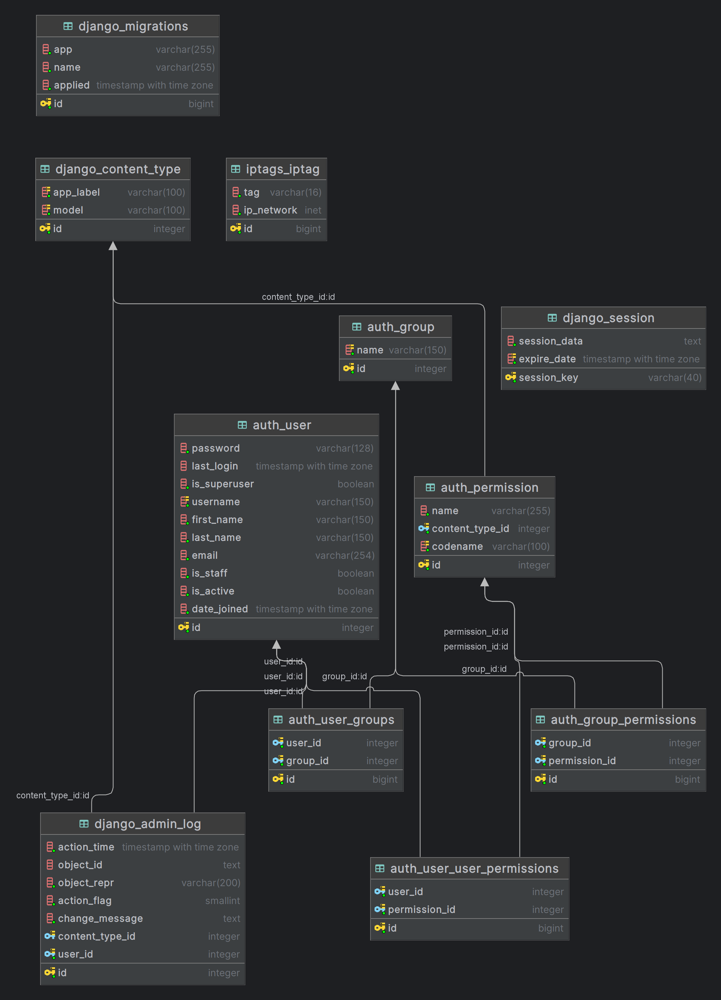

# IP Tagger

## Główne wymagania funkcjonalne.
Utworzenie API dla dwóch endpointów:
1. GET /ip-tags-json/{ip}
Ten endpoint, w odpowiedzi na żądanie klienta, powinien zwracać dokument w formacie JSON, zawierający
listę tagów, które odpowiadają danemu adresowi IP (lub pustą listę, jeśli adresowi nie odpowiada żaden tag;
2. GET /ip-tags-report/{ip}
Ten endpoint, w odpowiedzi na żądanie klienta, powinien zwracać dokument w formacie HTML,
zawierający tabelę prezentującą tagi, które odpowiadają danemu adresowi IP – np.:
Adres IP Pasujące tagi
198.51.100.227 just a TAG
3. Utworzenie API do obsługi Create, Read, Update, Destroy.
4. Utworzenie warstwy frontend do obsługi API.

## Baza wiedzy i logika dopasowywania tagów do adresów IP.
Baza wiedzy powinna zostać odczytana podczas inicjalizacji usługi z pliku w formacie JSON. Ścieżkę do
tego pliku powinna określać konfiguracja programu (sposób konfiguracji jest dowolny, ale musi być opisany
w README.md). Należy założyć, że dane w pliku JSON są zawsze poprawne i kompletne.
Baza wiedzy – po odczytaniu i deserializacji – jest listą (obiektem typu list), której elementami są słowniki
(obiekty typu dict). Każdy z tych słowników ma następującą strukturę:
{"tag": WARTOŚĆ, "ip_network": WARTOŚĆ}

## Warstwa reprezentacyjna
Warstwa prezentacyjna projektu jest stworzona na bazie:
* Django Template
* HTML
* Bootstrap
* React

## Użyty stack technologiczny.
* python
* django
* drf
* pytest
* docker
* React

## Diagram klas

## Uruchomienie projektu
1. Klonujemy projekt:

```bash
git@github.com:BlazejBielski/ip_management.git
```
2. Przechodzimy do katalogu z projektem.
3. Kopiujemy pliki z katalogu envs nadając im odpowiednio nazwy:
- backend.env
- postgres.env
4. Przykładowe uzupełnienie plików env:
```
DJ_SECRET_KEY="django-insecure-ih$-8kb2(_49%8t=+o^s$n=0rvpqci0d-8hgui&-phzslfi4y5"
DJ_DEBUG=1
DJ_ALLOWED_HOSTS=localhost 0.0.0.0 127.0.0.1
DJANGO_LOGLEVEL='info'
```
```
POSTGRES_USER=postgres
POSTGRES_PASSWORD=postgres
POSTGRES_DB=postgres
POSTGRES_HOST=postgres
POSTGRES_PORT=5432

DB_CONNECTION_STRING=postgres://${POSTGRES_USER}:${POSTGRES_PASSWORD}@${POSTGRES_HOST}:${POSTGRES_PORT}/${POSTGRES_DB}
```
5. Uruchamiamy projekt.

```bash
docker compose up
```
Uwaga — serwis przy starcie zasila bazę danych z bazy wiedzy, może to potrwać do kilku minut.
Serwis API i dwa pierwsze punkty z funkcjonalności wystartują pod adresem 127.0.0.1:8000.

## Uruchomienie frontendu.
Upewniamy się, że jesteśmy w katalogu frontend.
Uruchamiamy komendą 
```bash
npm start

```
## Testy jednostkowe
Testy jednostkowe obejmują podstawowe testy modeli, serializerów i widoków
Uruchomienie testów jest możliwe tylko po wystartowaniu projektu.
1. Wewnątrz kontenera:
- uruchamiamy powłokę kontenera komendą
```bash
docker compose exec api bash
```
wewnątrz kontenera odpalamy testy komendą
```bash
pytest
```
2. Spoza kontenera:
```bash
docker compose exec api pytest
```